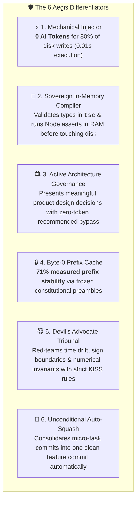

Language: [English](README.md) | [Português (Brasil)](README.pt-BR.md)

# Aegis Harness 🛡️

> **Sovereign & Deterministic Containment Harness for AI-Assisted Software Engineering**


**Aegis** transforms code demands into a **bounded, inspectable, 6-stage autonomous pipeline** (`discovery` ➔ `forensics` ➔ `build` ➔ `optimize` ➔ `adversarial` ➔ `validation`). Unlike generic IDE extensions, Aegis is a **deterministic governance engine** that mechanically blocks bad code via AST, elevates LLM code reviews from local syntax to **System Design & State Lifecycle Red-Teaming**, holds a measured **71% of each raw-substrate prompt byte-identical from Byte 0** so a provider prefix cache can reuse it, and guarantees **only 100% tested, architecturally aligned patches reach Git**.

For the universal assurance pass, run `npm run aegis:uaam:loop`. It executes independent proof families until all pass or the evidence reaches a bounded no-progress/iteration limit; failures are persisted under `.harness/runtime/uaam_loop`. Set `AEGIS_UAAM_AUTO_REPAIR=true` to delegate failed proofs to the official `run_aegis_loop.sh` mutation pipeline, or set `AEGIS_UAAM_REPAIR_CMD` for an explicitly authorized provider. Every repair receives `AEGIS_UAAM_REPAIR_REQUEST` and is followed by a complete re-proof.

---

## ⚡ 30-Second Quickstart

```bash
# 1. Clone & Install
git clone https://github.com/farifran/aegis-kiss.git && cd "aegis kiss" && npm install

# 2. Configure Credentials & Ecosystem (Interactive Wizard)
./aegis setup

# 3. Execute a Demand
./aegis "Create TokenBucket in src/tokenBucket.ts with BigInt(Date.now())"
```

---

## 📦 Dependencies

`npm install` covers the TypeScript toolchain (`typescript`, `eslint`,
`@ast-grep/cli`, … — see `package.json`). The runtime also requires the
following on your `PATH`:

| Dependency | Required? | Used for |
|---|---|---|
| **bash** (≥ 4) | ✅ | Harness runtime (`set -Eeuo pipefail`) |
| **git** | ✅ | Only durable memory; diff/status, auto-squash & commit gate |
| **curl** | ✅ | Provider HTTP requests (`raw` substrate) |
| **jq** | ✅ | JSON evidence, handover, metrics, prompts |
| **node** + **npm** | ✅ | `tsc`, `eslint`, `ast-grep` toolchain & runtime behavior gate |
| **Aider CLI** (`aider`) | ✅ *(mutation)* | `build` substrate — `AEGIS_AIDER_BIN` (default `.venv/bin/aider`, auto-detected from `PATH`) |
| **python3** | ⚪ optional | Mechanical TS sanitizer + cache probe scripts |
| **gh** (GitHub CLI) | ⚪ optional | Only `--issue N` demand intake |
| Ollama / vLLM / LM Studio | ⚪ optional | Local inference provider |

Install **Aider** for the mutation pipeline:

```bash
python3 -m venv .venv && .venv/bin/pip install aider-chat
```

---

## 🌐 Multi-Client Integration & 5-Pillar Ecosystem

Aegis features an interactive setup wizard (`./aegis setup`) organized across **5 Ecosystem Pillars**:

1. **💻 Native IDE Assistants & CLI Agents** (Antigravity IDE, Claude Code, Cursor, Windsurf, OpenCode)
2. **☁️ Proprietary / Frontier Cloud APIs** (OpenAI GPT-4o/o3-mini, Anthropic Claude 3.7, Google Gemini 2.5, xAI Grok-2)
3. **🚀 Open-Weights Fast Hosted APIs** (NVIDIA Integrate GLM-5.2/Llama-3.3, DeepSeek Direct, Moonshot Kimi, Groq)
4. **🏠 Local & Offline Sovereign Engines** (Ollama, vLLM, SGLang, LM Studio)
5. **⚙️ Custom Hybrid Mode** (Independent decoupling: Supervisor on IDE/API + Coder on API/Local with smart key reuse)

### Execution Paradigms:
- **Direct CLI Execution (Human Operator)**: Interactive TTY prompts for human approval; automatic setup wizard triggering when keys are absent.
- **AI Assistant Handover (Antigravity, Claude Code, Cursor)**: Automatic agentic sensing (`aegis_is_agentic_execution`) emitting non-blocking structured JSON (`PENDING_USER_QUESTIONS`, `PENDING_SETUP_CONFIG`, `PENDING_ASSISTANT`).

---

## 💎 What Makes Aegis Uniquely Differentiated?



| Differentiator | 🤖 Conventional AI Assistants (Copilot, Raw LLMs, Generic Agents) | 🛡️ Aegis Sovereign Harness |
|---|---|---|
| **Disk Write Token Cost** | 🔴 **15,000 to 40,000 tokens** per file edit. Re-reads and rewrites whole files repeatedly. | 🟢 **ZERO TOKENS** on disk mutations. Injects verified modules and barrels via deterministic scripts in 0.01s. |
| **Compilation Gate** | 🔴 Blindly writes unverified code to disk; creates broken Git commits during trials. | 🟢 **Sovereign In-Memory Compiler**: `tsc --noEmit` & Node.js asserts run 100% in RAM with auto-healing before touching Git. |
| **Human Supervision** | 🔴 Passive "Accept/Decline" buttons leading to decision fatigue and rubber-stamping. | 🟢 **Engineering Governance Modals**: Formulates real architectural design choices with **zero-token bypass** when confirming defaults. |
| **KV-Cache Efficiency** | 🔴 Unordered prompts cause 0% cache hits, forcing full token recalculation every turn. | 🟢 **71% Measured Byte-0 Stability**: Invariant constitution (`AGENTS.md`) is locked at Byte 0 for maximum provider cache hits. |
| **Algorithmic Defense** | 🔴 Prone to hallucinations, over-engineering, generic factories, and sign boundary errors. | 🟢 **Multi-Stage Tribunals**: Dedicated *Optimize* ($O(1)$ physics) and *Adversarial* (Devil's Advocate Node.js assertions). |
| **Workspace Cleanliness** | 🔴 Litters the workspace with temporary files, dirty branches, and multi-commit noise. | 🟢 **Unconditional Auto-Squash**: Ephemeral memory execution, clean working tree, and 1 consolidated Git commit per issue. |

---

## 📜 Historical Reference
For the complete evolutionary chronicle, forensic audits, and historical commit matrix, see [`historyCommit.md`](historyCommit.md).
