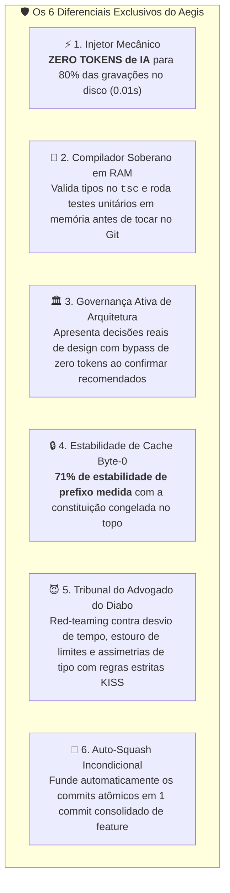

Idioma: [English](README.md) | [Português (Brasil)](README.pt-BR.md)

# Aegis Harness 🛡️

> **Harness Soberano e Determinístico de Contenção para Engenharia de Software Assistida por IA**


O **Aegis** transforma demandas de código em um **pipeline autônomo e auditável de 6 estágios** (`discovery` ➔ `forensics` ➔ `build` ➔ `optimize` ➔ `adversarial` ➔ `validation`). Diferente de extensões genéricas de IDE, o Aegis é um **motor de governança determinístico** que bloqueia mecanicamente código ruim via AST, eleva revisões de código de simples sintaxe para **Red-Teaming de Design de Sistema e Ciclo de Vida de Estado**, mantém **71% de cada prompt do substrato raw byte a byte idêntico a partir do Byte 0** para reaproveitamento em cache de prefixo do provedor, e garante que **apenas patches 100% testados e alinhados à arquitetura cheguem ao Git**.

---

## ⚡ Início Rápido em 30 Segundos

```bash
# 1. Clonar e Instalar
git clone https://github.com/farifran/aegis-kiss.git && cd "aegis kiss" && npm install

# 2. Configurar Credenciais e Ecossistema (Wizard Interativo)
./aegis setup

# 3. Executar uma Demanda
./aegis "Crie TokenBucket em src/tokenBucket.ts com BigInt(Date.now())"
```

---

## 📦 Dependências

O `npm install` cobre o ecossistema TypeScript (`typescript`, `eslint`,
`@ast-grep/cli`, … — veja o `package.json`). O runtime também requer as
seguintes ferramentas instaladas no seu `PATH`:

| Dependência | Obrigatória? | Finalidade |
|---|---|---|
| **bash** (≥ 4) | ✅ | Runtime do harness (`set -Eeuo pipefail`) |
| **git** | ✅ | Única memória durável; diff/status, auto-squash e portão de commit |
| **curl** | ✅ | Requisições HTTP para provedores (substrato `raw`) |
| **jq** | ✅ | Evidências JSON, handover, métricas e prompts |
| **node** + **npm** | ✅ | Toolchain `tsc`, `eslint`, `ast-grep` e gate de execução de behavior |
| **Aider CLI** (`aider`) | ✅ *(mutação)* | Substrato `build` — `AEGIS_AIDER_BIN` (padrão `.venv/bin/aider`, detectado via `PATH`) |
| **python3** | ⚪ opcional | Sanitizador mecânico de TS + scripts de sonda de cache |
| **gh** (GitHub CLI) | ⚪ opcional | Apenas para intake via `--issue N` |
| Ollama / vLLM / LM Studio | ⚪ opcional | Provedores locais de inferência |

Instale o **Aider** para o pipeline de mutação:

```bash
python3 -m venv .venv && .venv/bin/pip install aider-chat
```

---

## 🌐 Integração Multi-Cliente & Ecossistema em 5 Pilares

O Aegis conta com um assistente interativo de configuração (`./aegis setup`) estruturado em **5 Pilares de Ecossistema**:

1. **💻 Assistentes Nativos de IDE & Agentes de CLI** (Antigravity IDE, Claude Code, Cursor, Windsurf, OpenCode)
2. **☁️ APIs Proprietárias / Fronteira em Nuvem** (OpenAI GPT-4o/o3-mini, Anthropic Claude 3.7, Google Gemini 2.5, xAI Grok-2)
3. **🚀 Modelos Abertos & APIs Rápidas Hospedadas** (NVIDIA Integrate GLM-5.2/Llama-3.3, DeepSeek Direct, Moonshot Kimi, Groq)
4. **🏠 Motores Locais & Soberania Offline** (Ollama, vLLM, SGLang, LM Studio)
5. **⚙️ Modo Híbrido Personalizado** (Desacoplamento independente: Supervisor no IDE/API + Coder na API/Local com reuso inteligente de chaves)

### Paradigmas de Execução:
- **Execução Direta via CLI (Operador Humano)**: Prompts interativos de terminal e disparo automático do wizard se chaves estiverem ausentes.
- **Handover para Assistentes de IA (Antigravity, Claude Code, Cursor)**: Detecção automática de ambiente (`aegis_is_agentic_execution`) emitindo JSON não-bloqueante (`PENDING_USER_QUESTIONS`, `PENDING_SETUP_CONFIG`, `PENDING_ASSISTANT`).

---

## 💎 O Que Torna o Aegis Único e Diferenciado?



| Diferencial | 🤖 Assistentes Convencionais de IA (Copilot, Raw LLMs, Agentes Genéricos) | 🛡️ Harness Soberano Aegis |
|---|---|---|
| **Custo de Tokens na Gravação** | 🔴 **15.000 a 40.000 tokens** por edição. Lê e reescreve arquivos inteiros repetidamente. | 🟢 **ZERO TOKENS** nas mutações de código. Injeta módulos e barrels verificados via scripts em 0.01s. |
| **Portão de Compilação** | 🔴 Grava código não testado direto no disco; gera commits quebrados no Git. | 🟢 **Compilador Soberano em RAM**: `tsc --noEmit` e testes Node rodam 100% em memória antes de tocar no disco. |
| **Supervisão Humana** | 🔴 Botões passivos de "Aceitar/Rejeitar" que causam fadiga de decisão e aprovações cegas. | 🟢 **Modais de Governança de Engenharia**: Formula decisões reais de arquitetura com **bypass de 0 tokens** ao confirmar defaults. |
| **Eficiência de KV-Cache** | 🔴 Prompts desordenados resultam em 0% de cache hit, recalculando tudo a cada mensagem. | 🟢 **71% de Estabilidade Medida no Byte 0**: A constituição (`AGENTS.md`) é congelada no topo para reaproveitamento total de cache. |
| **Defesa Algorítmica** | 🔴 Propenso a alucinações, sobre-engenharia, factories genéricas e erros de sinal/tempo. | 🟢 **Tribunais Multi-Estágio**: Modos dedicados *Optimize* (física $O(1)$) e *Adversarial* (Advogado do Diabo com asserts reais em Node.js). |
| **Limpeza do Workspace** | 🔴 Polui o repositório com rascunhos temporários, branches sujas e ruído de múltiplos commits. | 🟢 **Auto-Squash Incondicional**: Execução em memória efêmera, working tree limpo e exatamente 1 commit consolidado por issue. |

---

## 📜 Referência Histórica
Para a crônica completa da evolução, auditorias forenses e a matriz histórica de commits, consulte [`historyCommit.md`](historyCommit.md).
