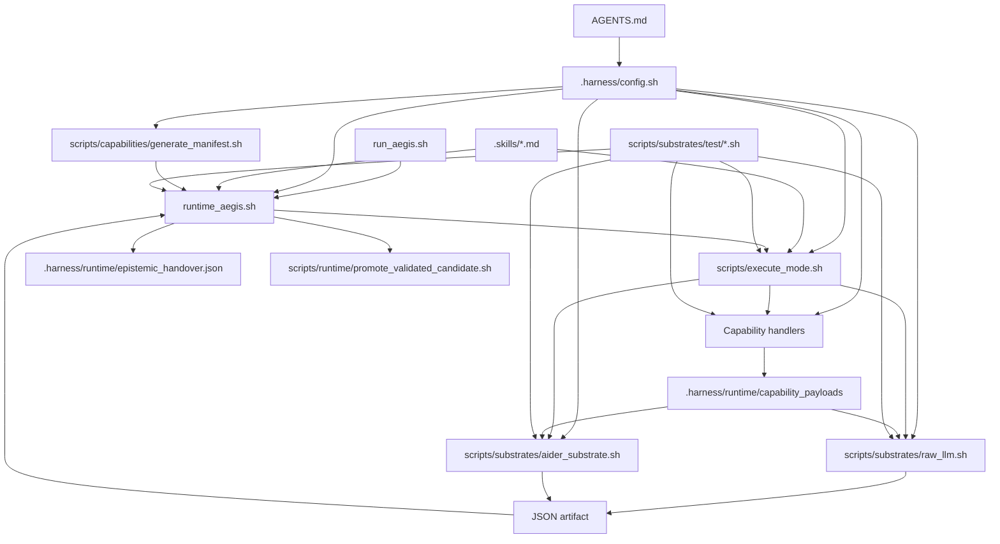

# Aegis Harness Summary

## Purpose of This Document

This file is a descriptive map of the repository as it exists in the current workspace.

It answers three practical questions:

1. Which files exist and what does each one do?
2. How do those files relate during execution?
3. Which declared parts of the architecture are present, generated, missing, or stale?

This document is not constitutional. If it conflicts with the authoritative contract, precedence is:

1. `AGENTS.md`
2. `.harness/config.sh`
3. runtime-generated manifests and capability contracts
4. mode contracts under `.skills/`
5. transient runtime artifacts under `.harness/runtime/`
6. the rest of the repository

## One-Sentence System Summary

**Aegis Harness v1.0.0 (Estável / Homologada)** is a runtime-sovereign execution harness that exposes bounded capability evidence to mode contracts, routes execution through a protocol VM, and promotes only validated JSON artifacts back into runtime-owned handover state.

Current Suite Status: **all 16 npm-chained test suites passing green (Exit 0)** (`npm run aegis:test`), with static verification, eslint boundaries enforcement, type checking, and cross-platform verification (validated on Linux and macOS). The chain includes `aegis:test:required-evidence-augmentation`, `aegis:test:sovereignty-fallback`, and the fail-powered `aegis:test:model-boundary-idempotency` (proves an injected model survives a stripped `env -i` config re-source and can never be clobbered back to a default).

### Model configuration hardening (process-boundary idempotency)
The model-resolution block in `.harness/config.sh` is now idempotent and defensive: there is **no non-frontier fallback** (the `google/gemma-4-31b-it` default was removed). Every model assignment honors an already-set/injected value, so a re-source inside a stripped `env -i` substrate boundary can never clobber an injected `AEGIS_AIDER_MODEL`/`AEGIS_MUTATION_MODEL`. A model-requiring context (cognition substrates export `AEGIS_REQUIRE_MODEL=1`) with no model in any form hard-fails with `missing_model_configuration`; the observation layer (capability handlers, manifest generation) never sets the flag and sources config model-less without fatal. `validate_provider_configuration` now asserts on `AEGIS_OPERATOR_MODEL_RAW` — a snapshot captured before any defaulting — instead of a post-default tautology. `aider_substrate.sh` additionally refuses a gemma-class model under `whole` edit format up front (`stalling_model_configuration`) rather than burning the watchdog budget on a known stall.

## High-Level Execution Graph



## Why These Files Exist

The repository is intentionally split so that authority, wiring, execution, evidence, and verification do not collapse into one script.

### 1. Governance stays separate from execution

`AGENTS.md`, `.harness/00_architecture_core.md`, and `.skills/*.md` exist so the meaning of the system is declared outside the runtime entrypoints.

That separation matters because `runtime_aegis.sh` and `scripts/execute_mode.sh` can change implementation details without silently redefining constitutional rules, mode semantics, or allowed evidence behavior.

### 2. One file owns topology, not business logic spread across scripts

`.harness/config.sh` exists to centralize mode registration, capability handlers, evidence profiles, provider defaults, and runtime paths.

The practical justification is containment: the executor, manifest generator, substrate, and tests all read the same wiring source instead of duplicating configuration in multiple places.

### 3. Runtime orchestration and mode execution are split on purpose

`runtime_aegis.sh` exists to own lifecycle concerns such as environment checks, handover reset or promotion, runtime directory preparation, and final cleanup.

`scripts/execute_mode.sh` exists separately because capability materialization and substrate invocation are a smaller protocol-execution concern. Keeping those roles apart reduces the chance that mode execution logic quietly takes ownership of runtime policy.

### 4. Capability handlers are individual files so authority remains inspectable

Files under `scripts/capabilities/` are separate handlers rather than shell branches inside one monolith.

The justification is auditability: each capability has a named surface, a concrete implementation, and a clear registration point in `.harness/config.sh`, which makes manifests and tests easier to align with the actual authority surface.

### 5. The test suite mirrors architectural promises

The shell tests under `scripts/substrates/test/` exist because most of the important guarantees in this repository are runtime contracts, not just library-level functions.

They verify that the constitutional model, capability exposure rules, handover semantics, readonly execution path, mutation substrate path, and promotion pipeline still match what the repository claims.

### 6. The TypeScript tree is structural support, not the main runtime

The `src/` files currently exist mostly to keep TypeScript, ESLint, and boundaries rules anchored to a minimal source surface.

That is why they look thinner than the shell runtime: today they support tooling discipline more than product behavior.

## Repository Tree Snapshot

The following tree is a compact snapshot of the current workspace structure.

It is included to make the repository shape visible at a glance before the per-file explanation below.

```text
.
├── .harness/
│   ├── 00_architecture_core.md
│   ├── config.sh
│   ├── enforcement/
│   │   └── ast_grep_rules.yml
│   ├── execution_surfaces/
│   ├── local.env
│   └── runtime/
│       └── epistemic_handover.json
├── .skills/
│   ├── adversarial.md
│   ├── discovery.md
│   ├── forensics.md
│   ├── optimize.md
│   ├── repair.md
│   └── validation.md
├── AGENTS.md
├── LICENSE.md
├── README.md
├── summary.md
├── eslint.config.js
├── package-lock.json
├── package.json
├── run_aegis.sh
├── runtime_aegis.sh
├── tsconfig.json
├── scripts/
│   ├── audit_epistemic_pipeline.sh
│   ├── execute_mode.sh
│   ├── lib/
│   │   └── common.sh
│   ├── capabilities/
│   │   ├── eslint_check.sh
│   │   ├── generate_manifest.sh
│   │   ├── test_runner.sh
│   │   ├── typescript_check.sh
│   │   ├── filesystem/
│   │   │   ├── _shared_utils.sh
│   │   │   ├── _walk.py
│   │   │   ├── extract_configuration_structure.sh
│   │   │   ├── extract_entrypoints.sh
│   │   │   ├── extract_import_graph.sh
│   │   │   ├── extract_reference_graph.sh
│   │   │   ├── extract_responsibilities.sh
│   │   │   ├── extract_symbols.sh
│   │   │   ├── extract_test_relationships.sh
│   │   │   ├── list_tree.sh
│   │   │   ├── read_file.sh
│   │   │   └── search_symbol.sh
│   │   ├── git/
│   │   │   ├── git_diff.sh
│   │   │   └── git_status.sh
│   │   ├── runtime/
│   │   │   ├── attention_seed.sh
│   │   │   └── layer0_facts.sh
│   │   └── structural/
│   │       └── builder.sh
│   ├── runtime/
│   │   ├── apply_candidate_diff.sh
│   │   └── promote_validated_candidate.sh
│   └── substrates/
│       ├── aider_lint_gate.sh
│       ├── aider_substrate.sh
│       ├── raw_llm.sh
│       └── test/
│           ├── _test_lib.sh
│           ├── mock_openai_curl.sh
│           ├── mock_provider.sh
│           ├── probes/
│           │   └── leak_probe.sh
│           ├── test_adversarial_contract.sh
│           ├── test_aider_substrate.sh
│           ├── test_authority_isolation.sh
│           ├── test_candidate_continuity.sh
│           ├── test_capabilities.sh
│           ├── test_constitutional_invariants.sh
│           ├── test_epistemic_pipeline_audit.sh
│           ├── test_forensics_behavior.sh
│           ├── test_readonly_modes.sh
│           ├── test_recognition_benchmarks.sh
│           ├── test_required_evidence_augmentation.sh
│           ├── test_runtime_contract.sh
│           ├── test_secret_containment.sh
│           ├── test_sovereignty_fallback.sh
│           └── test_validation_and_promotion.sh
├── src/
│   ├── index.ts
│   └── ui/
│       ├── fake_import.ts
│       └── index.ts
└── tests/
    └── scenarios/            (bash, cycle, hub, microservice, monolith, multi_surface, node, python fixtures)
```

Directories intentionally excluded from the tree above: `.git/` and `node_modules/`, because they are repository metadata or installed dependencies rather than project source.

## Repository Structure by File

Observed runtime-generated files in workspace: `1` (`.harness/runtime/epistemic_handover.json`).

Directories such as `.git/` and `node_modules/` are intentionally excluded from the logical map below because they are repository metadata or installed dependencies rather than project source.

### Root Files

| Path | Function inside the project | Relationship to other files |
| --- | --- | --- |
| `AGENTS.md` | Aegis Cognition Contract. Guides how the model must interpret and reason within the authority defined by the runtime. It exists to enforce behavior discipline (Runtime Authority, Evidence Discipline, KISS, Ephemeral Cognition). | Loaded by `execute_mode.sh` to dynamically extract raw rules and set `AEGIS_CONSTITUTIONAL_PREAMBLE` before executing cognitive substrates. |
| `README.md` | Public architecture and usage overview. Explains runtime, capabilities, modes, and common commands. It exists for operator orientation rather than normative control. | Summarizes the structure defined by `AGENTS.md`, `.harness/config.sh`, `runtime_aegis.sh`, `scripts/execute_mode.sh`, and the scripts under `scripts/`. |
| `summary.md` | This repository map. Documents observed structure, file roles, current cross-file relationships, and known structural mismatches. | Secondary to `AGENTS.md` and `.harness/config.sh`; should stay aligned with `README.md`, runtime files, and the actual tree. |
| `package.json` | Node package manifest for local tooling. Declares lint, typecheck, enforcement, and shell-based test scripts. It exists to make structural verification reproducible from one entrypoint. | Invokes `runtime_aegis.sh` and the test harnesses under `scripts/substrates/test/`. Depends on `eslint.config.js` and `tsconfig.json` for JS/TS validation. |
| `package-lock.json` | NPM lockfile that pins exact dev dependency versions. | Freezes the toolchain used by `package.json`, especially TypeScript, ESLint, and ast-grep. |
| `tsconfig.json` | TypeScript compiler policy for the small `src/` tree. It exists because the repository still wants typed structural discipline even though the main runtime is shell-based. | Used by `package.json` typecheck scripts and by `eslint.config.js` parser options. Covers `src/` and `.harness/`. |
| `eslint.config.js` | ESLint flat config with structural dependency rules via `eslint-plugin-boundaries`. It exists to encode layering assumptions mechanically rather than leaving them as prose. | Enforces layering over `src/**/*.ts`; complements `tsconfig.json` and the scripts in `package.json`. |
| `.gitignore` | Ignore policy for runtime residue, execution surfaces, aider artifacts, transient logs, and dependencies. | Describes which files created by `runtime_aegis.sh`, `scripts/execute_mode.sh`, and external tooling should not be committed. |
| `run_aegis.sh` | Fail-fast pipeline driver over `runtime_aegis.sh`. Owns operator CLI (pipeline selection `mutation`/`readonly`, `--resume`, `--until`, `--target`, `--issue`, `--force-apply`), dependency checks, per-mode timing capture, and the final run report (timings, final mode, attention targets, verdict). Halts before `repair` when the handover carries zero repair candidates. Mode order is derived from its authoritative `PIPELINES` definition. `--force-apply` is the standard operational override for zero-command deployment on partial/truncated cycles (e.g. `--until optimize`): it is forwarded ONLY to the final executed mode, promotes the candidate diff under an explicit `operator_forced` verdict envelope (never `accepted`), emits a loud FORCE-APPLY warning, and keeps every structural promotion rail (path jail, `files_changed` cross-check, dirty-target refusal, atomic `git apply`) fully active. | Invokes `runtime_aegis.sh` once per mode; reads `.harness/runtime/epistemic_handover.json` for resume/report data. |
| `runtime_aegis.sh` | Sovereign runtime orchestrator. Validates environment, prepares runtime surfaces, resets or promotes handover, delegates mode execution, and cleans up. It exists to keep lifecycle authority in one place. | Loads `.harness/config.sh`, selects `.skills/<mode>.md`, generates manifests via `scripts/capabilities/generate_manifest.sh`, delegates to `scripts/execute_mode.sh`, writes `.harness/runtime/epistemic_handover.json`, and for mutation modes drives candidate promotion via `scripts/runtime/*`. |
| `LICENSE.md` | Repository license file. | Legal metadata only; not part of execution flow. |

### Harness Configuration and Governance

| Path | Function inside the project | Relationship to other files |
| --- | --- | --- |
| `.harness/config.sh` | Operational topology source of truth. Declares runtime directories, budgets, provider defaults, execution engines, capability maps, handler registry, and evidence profiles. | Loaded by `runtime_aegis.sh`, `scripts/execute_mode.sh`, `scripts/capabilities/generate_manifest.sh`, `scripts/substrates/raw_llm.sh`, `scripts/substrates/aider_substrate.sh`, and the shell tests. It is the central wiring file of the repository. |
| `.harness/00_architecture_core.md` | Supplemental architecture doctrine explaining structural truth, cognition layering, and runtime separation. | Supports the constitutional model from `AGENTS.md` and informs the language used by `README.md` and the mode contracts. |
| `.harness/enforcement/ast_grep_rules.yml` | Mechanical enforcement rules for structural containment. | Used by the `aegis:enforce` script in `package.json` to add automated checks alongside ESLint and TypeScript. |
| `.harness/local.env` | Git-ignored local provider credentials (e.g. `OPENAI_API_KEY`, `OPENAI_API_BASE`). Sourced by `runtime_aegis.sh` only when a real (non-test) key is present. | Feeds the executor, which injects credentials only into substrate envs, never into capability envs. See "Verified Security Findings". |
| `.harness/execution_surfaces/` | Directory reserved for disposable mutation execution surfaces created per mode. | Populated by `runtime_aegis.sh` for mutation modes; cleaned up after promotion. |
| `.harness/runtime/epistemic_handover.json` | Current runtime-owned transient continuity artifact in the workspace. Stores `artifact_snapshot`, `epistemic_state`, and (for mutation modes) candidate references. | Read and normalized by `runtime_aegis.sh`; exposed to modes through runtime-selected `filesystem.read` payloads; expected by readonly mode tests. It is ignored by git but operationally central. |

### Mode Contracts

| Path | Function inside the project | Relationship to other files |
| --- | --- | --- |
| `.skills/discovery.md` | Contract for bounded observation mode. Focuses strictly on the *investigation state* and structural gaps. The structural metadata envelope is handled/populated by the executor. | Selected by `runtime_aegis.sh` when mode is `discovery`; consumed by `scripts/substrates/raw_llm.sh` as prompt context. Expectations are exercised by readonly mode tests. |
| `.skills/forensics.md` | Contract for bounded interpretation mode. Proposes repair candidates, excluding metadata fields. | Selected by `runtime_aegis.sh` for `forensics`; consumed by the raw substrate; behavior is targeted by `scripts/substrates/test/test_forensics_behavior.sh`. |
| `.skills/validation.md` | Contract for bounded verdict mode. Limits validation to exposed evidence. | Selected by `runtime_aegis.sh` for `validation`; paired with the readonly evidence profile from `.harness/config.sh`. |
| `.skills/adversarial.md` | Contract for bounded falsification mode. Challenges current results using observable evidence only. | Selected by `runtime_aegis.sh` for `adversarial`; receives readonly evidence chosen by `scripts/execute_mode.sh`. |
| `.skills/repair.md` | Contract for bounded mutation mode focused on corrective changes. | Declared in `.harness/config.sh` as an `aider` engine mode. Routed to `scripts/substrates/aider_substrate.sh` and then to the promotion pipeline. |
| `.skills/optimize.md` | Contract for bounded mutation mode focused on diff simplification. | Configured as an `aider` engine mode in `.harness/config.sh` and routed through the aider substrate and promotion pipeline. |

### Runtime, Executor, Capability, and Promotion Scripts

| Path | Function inside the project | Relationship to other files |
| --- | --- | --- |
| `scripts/execute_mode.sh` | Protocol VM. Resolves execution engine, capability envelope, evidence profile, capability arguments, payload generation, selected manifest, substrate call, and artifact validation. Dynamically extracts cognition contract rules from `AGENTS.md` to export `AEGIS_CONSTITUTIONAL_PREAMBLE`. Normalizes and auto-populates structural envelope fields (`mode`, `status`, `handover_attention`) deterministically on cognitive outputs. | Called by `runtime_aegis.sh`; loads `.harness/config.sh`; materializes wrappers for handlers under `scripts/capabilities/`; calls `scripts/substrates/raw_llm.sh` for readonly modes and `scripts/substrates/aider_substrate.sh` for mutation modes. |
| `scripts/lib/common.sh` | Source-only shared library: tagged logging (`aegis_log`/`aegis_warn`/`aegis_fatal` via `AEGIS_LOG_TAG`) and the fork-free `measure` timing helper (`printf '%(%s)T'`). | Sourced by `runtime_aegis.sh`, `scripts/execute_mode.sh`, and both substrates. |
| `scripts/audit_epistemic_pipeline.sh` | Epistemic pipeline auditor. Checks all boundary transitions. | Backs `test_epistemic_pipeline_audit.sh`; verifies handover/payload provenance. |
| `scripts/capabilities/generate_manifest.sh` | Deterministic manifest generator for all modes, engines, envelopes, handler provenance, and evidence profiles. | Loads `.harness/config.sh`; is invoked by `runtime_aegis.sh`; its output is consumed and sliced per mode by `scripts/execute_mode.sh`. |
| `scripts/capabilities/filesystem/list_tree.sh` | Readonly capability that emits a pruned, deterministic repository tree as JSON evidence. | Registered in `.harness/config.sh`; wrapped by `scripts/execute_mode.sh`; primarily used in discovery evidence profiles and validated by `test_capabilities.sh`. |
| `scripts/capabilities/filesystem/read_file.sh` | Readonly capability that emits bounded file contents as JSON evidence. | Registered in `.harness/config.sh`; exposed in capability envelopes; validated by `test_capabilities.sh`; useful for direct file evidence rather than full tree exposure. |
| `scripts/capabilities/filesystem/search_symbol.sh` | Readonly capability that performs bounded grep-style symbol search with context and payload-size limits. | Registered in `.harness/config.sh`; heavily used across discovery, forensics, adversarial, repair, and optimize evidence profiles. |
| `scripts/capabilities/filesystem/extract_symbols.sh` | Readonly capability that extracts symbol-level structure from source files. | Part of the `filesystem.*` evidence family; used by structural and discovery profiles. |
| `scripts/capabilities/filesystem/extract_entrypoints.sh` | Readonly capability that surfaces entrypoints of the repository. | Feeds discovery/forensics evidence; part of the `filesystem.*` family. |
| `scripts/capabilities/filesystem/extract_import_graph.sh` | Readonly capability that emits the import graph as evidence. | Feeds structural analysis and the `structural/builder.sh` capability. |
| `scripts/capabilities/filesystem/extract_reference_graph.sh` | Readonly capability that emits the reverse reference graph as evidence. | Feeds structural analysis evidence profiles. |
| `scripts/capabilities/filesystem/extract_test_relationships.sh` | Readonly capability that maps tests to the code they exercise. | Feeds validation and adversarial evidence profiles. |
| `scripts/capabilities/filesystem/extract_configuration_structure.sh` | Readonly capability that emits structure/keys from config files without exposing values. | Evidence-only: returns keys, not values. Used in forensics profiles. |
| `scripts/capabilities/filesystem/extract_responsibilities.sh` | Readonly capability that emits mechanical responsibility classification for files. | Part of the `filesystem.*` evidence family; supports discovery/forensics profiles. |
| `scripts/capabilities/git/git_status.sh` | Readonly capability that emits `git status --short` as JSON evidence. | Registered in `.harness/config.sh`; used by forensics, repair, and optimize evidence profiles. |
| `scripts/capabilities/git/git_diff.sh` | Readonly capability that emits the current uncommitted diff as JSON evidence. | Registered in `.harness/config.sh`; exposed only in mutation envelopes and related evidence profiles. |
| `scripts/capabilities/typescript_check.sh` | Readonly capability that runs a bounded `tsc` check and emits its result as evidence. | Mutation/repair evidence profiles; part of the build-feedback capability surface. |
| `scripts/capabilities/eslint_check.sh` | Readonly capability that runs a bounded ESLint check and emits its result as evidence. | Mutation/repair evidence profiles; part of the build-feedback capability surface. |
| `scripts/capabilities/test_runner.sh` | Readonly capability that runs the suite and emits pass/fail evidence. | Mutation/repair evidence profiles; provides test-feedback evidence to mutation modes. |
| `scripts/capabilities/runtime/attention_seed.sh` | Runtime-owned capability that emits the deterministic attention seed (investigation scope, attention targets, blocking conditions) consumed during artifact normalization. | Its payload (`runtime_attention_seed.json`) feeds the discovery-enrichment branch of `normalize_substrate_output` in `scripts/execute_mode.sh`. |
| `scripts/capabilities/runtime/layer0_facts.sh` | Runtime-owned capability that emits deterministic Layer 0 facts (declared entrypoints, `import_gravity`, churn/resonance `hot_files`). | Anchors Discovery/Forensics target resolution per the Layer 0 baseline-trust sections of `.skills/discovery.md` and `.skills/forensics.md`. |
| `scripts/capabilities/structural/builder.sh` | Readonly capability that synthesizes structural topology (boundaries, bridges, hotspots) from the import/reference graphs. | Consumes outputs of `extract_import_graph` and `extract_reference_graph`; feeds discovery/forensics profiles. |
| `scripts/substrates/raw_llm.sh` | Readonly cognition substrate. Builds bounded prompt context from the selected skill, selected manifest, and selected payloads, prepending `AEGIS_CONSTITUTIONAL_PREAMBLE`; then calls the provider and extracts one JSON artifact between markers. | Invoked by `scripts/execute_mode.sh` for `raw` modes; depends on `.harness/config.sh`, `.skills/*.md`, provider env vars, and the payloads created by capability scripts. |
| `scripts/substrates/aider_substrate.sh` | Mutation cognition substrate. Runs aider against the mutation execution surface using the active skill and capability payloads, prepending `AEGIS_CONSTITUTIONAL_PREAMBLE`; emits a mutation JSON artifact (diff, files_changed, rationale) between markers. | Invoked by `scripts/execute_mode.sh` for `aider` modes; receives `OPENAI_API_KEY`/`OPENAI_API_BASE` from the executor's mutation env whitelist. |
| `scripts/substrates/aider_lint_gate.sh` | Autonomous linting gate. Captures syntax breaks in milliseconds (`bash -n`, `node --check`, single-file `tsc --noResolve --skipLibCheck`) after applied aider edits to trigger immediate reflection/correction at source before validation stages. | Invoked automatically by Aider via `--lint-cmd` during the mutation process. |
| `scripts/runtime/apply_candidate_diff.sh` | Applies a validated mutation candidate diff to the mutation execution surface. | Called during the promotion phase orchestrated by `runtime_aegis.sh` for mutation modes. |
| `scripts/runtime/promote_validated_candidate.sh` | Promotes a validated, diff-bearing mutation candidate into runtime-owned handover state. | Final step of the mutation pipeline; called by `runtime_aegis.sh` after mutation artifact validation succeeds. Validates that the target files do not have uncommitted changes (`git diff --quiet HEAD`) before applying the patch. |

### Shell Test Harnesses

| Path | Function inside the project | Relationship to other files |
| --- | --- | --- |
| `scripts/substrates/test/test_capabilities.sh` | Direct capability harness. Creates temporary runtime context and validates successful JSON contracts for capability scripts. | Exercises filesystem and git capabilities against `.harness/config.sh`, including runtime-owned files read through `filesystem.read`. |
| `scripts/substrates/test/test_runtime_contract.sh` | Runtime-owned filesystem exposure contract test. Verifies that runtime-owned files are surfaced through `filesystem.read` and that specialized runtime read handlers are gone. | Checks manifest/config consolidation and validates reads of the epistemic handover through generic file reading. |
| `scripts/substrates/test/test_readonly_modes.sh` | Readonly runtime smoke suite. Starts a mock provider, runs readonly modes, and checks manifests, payload sets, default investigation input, and execution-surface behavior. | Exercises `runtime_aegis.sh`, `scripts/capabilities/generate_manifest.sh`, `scripts/execute_mode.sh`, `scripts/substrates/raw_llm.sh`, `.skills/discovery.md`, `.skills/forensics.md`, `.skills/validation.md`, and `.skills/adversarial.md`. |
| `scripts/substrates/test/test_constitutional_invariants.sh` | Constitutional invariant suite. Checks state registries, subprocess isolation, raw substrate isolation, investigation input continuity, and mode semantics. | Cross-checks `AGENTS.md` concepts against `.harness/config.sh`, `runtime_aegis.sh`, `scripts/execute_mode.sh`, and `scripts/substrates/raw_llm.sh`. |
| `scripts/substrates/test/test_forensics_behavior.sh` | Focused behavior test for discovery-to-forensics continuity and handover reset/promotion. | Runs `runtime_aegis.sh` with a mock provider and validates how `.harness/runtime/epistemic_handover.json` evolves between modes. |
| `scripts/substrates/test/test_adversarial_contract.sh` | Adversarial-mode contract test exercising falsification behavior under a mock provider. | Validates `.skills/adversarial.md` semantics and readonly evidence envelopes. |
| `scripts/substrates/test/test_aider_substrate.sh` | Mutation substrate behavior test. Runs the aider substrate against a mock provider and checks diff emission and artifact shape. | Exercises `scripts/substrates/aider_substrate.sh` and the mutation env whitelist. |
| `scripts/substrates/test/test_validation_and_promotion.sh` | Validation + promotion pipeline test. Verifies that a validated mutation candidate is promoted into handover state. | Exercises `scripts/runtime/promote_validated_candidate.sh` and `scripts/execute_mode.sh` mutation artifact validation. |
| `scripts/substrates/test/test_candidate_continuity.sh` | Candidate continuity test. Verifies that a promoted candidate survives across the lifecycle transitions the runtime owns. | Cross-checks `runtime_aegis.sh` promotion and `epistemic_handover.json` evolution for mutation modes. |
| `scripts/substrates/test/test_epistemic_pipeline_audit.sh` | Epistemic pipeline audit test. Verifies payload provenance and handover integrity end-to-end. | Backed by `scripts/audit_epistemic_pipeline.sh`. |
| `scripts/substrates/test/test_authority_isolation.sh` | Authority-isolation suite: envelope gate, deterministic fatal abort, env/fs containment, and path jail assertions. | Verifies capability handlers cannot exceed their declared envelope at runtime. |
| `scripts/substrates/test/test_recognition_benchmarks.sh` | Layer 0 recognition benchmarks (precision/recall over entrypoints, gravity nodes, churn⊕resonance ranking across fixture scenarios). | Exercises the structural Layer 0 facts against `tests/scenarios/` fixtures. |
| `scripts/substrates/test/test_required_evidence_augmentation.sh` | Harness for handover-driven evidence augmentation (`required_evidence` folding into the next mode's evidence entries). Chained as `aegis:test:required-evidence-augmentation`. | Exercises `augment_evidence_profile_from_handover` in `scripts/execute_mode.sh`. |
| `scripts/substrates/test/test_sovereignty_fallback.sh` | Harness for runtime sovereignty fallback behavior. Chained as `aegis:test:sovereignty-fallback`. | Exercises `runtime_aegis.sh` fallback paths. |
| `scripts/substrates/test/test_model_boundary_idempotency.sh` | Fail-powered proof that a model injected across a stripped `env -i` boundary survives a `.harness/config.sh` re-source byte-identically (positive), that a clobbering config is detected (negative power), and that a model-requiring context with no model hard-fails. Chained as `aegis:test:model-boundary-idempotency`. | Reproduces the substrate/config process boundary; guards the model-resolution idempotency in `.harness/config.sh`. |
| `scripts/substrates/test/_test_lib.sh` | Shared source-only helpers for the test harnesses. | Sourced by the `test_*.sh` suites. |
| `scripts/substrates/test/mock_openai_curl.sh` | Mock OpenAI-compatible provider used by the readonly and mutation suites. | Replaces the real `curl` provider call so tests run without real credentials. |
| `scripts/substrates/test/mock_provider.sh` | Alternate mock provider harness used by suites that need a running endpoint. | Complements `mock_openai_curl.sh` for provider-facing tests. |
| `scripts/substrates/test/test_secret_containment.sh` | Formal proof-of-containment test. Invokes the executor's real `invoke_capability_handler` with a probe capability while credentials are present in the parent env, and asserts `OPENAI_API_KEY` / `OPENAI_API_BASE` are absent from the spawned capability process. Has verified negative power: fails when the executor is mutated to leak credentials. | Exercises the `env -i` isolation boundary of `scripts/execute_mode.sh` by execution (not code inspection). Closes the audit gap between "code does not reference the variable" and "the variable does not reach the process". |
| `scripts/substrates/test/probes/leak_probe.sh` | Probe capability used only by `test_secret_containment.sh`. Emits the standard capability payload contract and reports (by set-ness, never by value) whether `OPENAI_*` variables are present in its environment, plus the env-var count. | Not a production capability; lives under `test/probes/` to keep it out of the registered capability surface. |

### TypeScript Surface

| Path | Function inside the project | Relationship to other files |
| --- | --- | --- |
| `src/index.ts` | Empty TypeScript entry placeholder. Exists mainly to keep the TS toolchain anchored to a minimal source tree. | Included by `tsconfig.json` and linted by `eslint.config.js`; currently has no runtime relationship to the shell harness. |
| `src/ui/index.ts` | Placeholder UI module with a comment only. | Serves as a minimal target for the ESLint boundaries rules that define a `ui` layer in `eslint.config.js`. |
| `src/ui/fake_import.ts` | Minimal exported function used to keep the UI layer non-empty. | Exists so the `src/ui/` area contains executable TS content covered by `tsconfig.json` and ESLint rules. |

## How the Main Files Work Together

### 1. Governance and topology

`AGENTS.md` defines the runtime cognition contract of the model.

`.harness/config.sh` turns that meaning into operational topology: paths, modes, engines, handler registry, evidence profiles, and limits.

Everything executable in the shell path takes its wiring from `.harness/config.sh`.

### 2. Runtime-owned execution (Adaptive Epistemic Lifecycle)

`runtime_aegis.sh` is the top-level orchestrator operating as a cyclic state machine.

It validates the environment, prepares or resets `.harness/runtime/epistemic_handover.json`, creates runtime-owned capability directories, generates the manifest via `scripts/capabilities/generate_manifest.sh`, and delegates mode execution to `scripts/execute_mode.sh` (which is the layer that dynamically extracts cognition contract rules from `AGENTS.md` as `AEGIS_CONSTITUTIONAL_PREAMBLE`).

After the substrate returns an artifact, the runtime validates it and promotes the artifact snapshot plus routed attention into the handover file. For mutation modes, a validated candidate is additionally promoted through `scripts/runtime/promote_validated_candidate.sh`, which enforces that the target files remain clean before patch application.

**Validation Feedback Loop & Cyclic Graph**: If the validator emits a `rejected` verdict, the handover accumulates the failure details/findings (*counterexamples*) and the runtime automatically loops back into `repair` mode. The execution flows through `repair -> optimize -> adversarial -> validation` for up to a hard ceiling of 2 repair attempts, with separate timing/performance metrics tracked per mode iteration to avoid metric contamination.

### 3. Capability evidence path

`scripts/execute_mode.sh` resolves the active capability envelope and evidence profile from `.harness/config.sh`.

It materializes wrapper executables in `.harness/runtime/capability_env/` (each a thin `exec bash <handler> "$@"` shim — no environment mutation), invokes the selected handlers under `scripts/capabilities/`, stores their JSON outputs in `.harness/runtime/capability_payloads/`, and builds a mode-specific manifest slice for the substrate.

### 4. Readonly cognition path

For readonly modes, `scripts/substrates/raw_llm.sh` receives four inputs:

1. the active model id
2. the active skill file from `.skills/`
3. the selected manifest JSON
4. the capability payload directory

It then constructs a bounded prompt using the investigation input, the skill contract, the selected manifest, and the selected payloads, calls the provider, and extracts exactly one JSON artifact between Aegis markers.

### 5. Mutation cognition and promotion path

For mutation modes, `scripts/execute_mode.sh` invokes `scripts/substrates/aider_substrate.sh` with the mutation env whitelist (which includes `OPENAI_API_KEY` / `OPENAI_API_BASE`). The substrate produces a mutation artifact carrying `diff` and `files_changed`.

`scripts/execute_mode.sh` then validates the mutation artifact (`validate_mutation_artifact`: mode match, non-empty diff, non-empty `files_changed`, valid JSON). On success the runtime promotes the candidate via `scripts/runtime/promote_validated_candidate.sh` and `apply_candidate_diff.sh`; on failure the executor terminates with a `mutation_artifact_*` fatal code.

### 6. Test coverage path

The shell tests under `scripts/substrates/test/` are the executable checks that connect the design docs to the runtime.

They verify capability contracts, readonly mode behavior, mutation substrate behavior, validation/promotion, candidate continuity, epistemic pipeline provenance, runtime-bound context semantics, and constitutional invariants.

### 7. Why the file layout matters operationally

The current layout is doing more than organizing files by topic.

It encodes the intended control boundary of the system:

1. top-level documents define meaning and operator-facing orientation
2. `.harness/` defines wiring and enforcement policy
3. `runtime_aegis.sh` owns lifecycle transitions and promotion
4. `scripts/execute_mode.sh` owns capability and substrate execution
5. `scripts/capabilities/` owns concrete authority surfaces (observation)
6. `scripts/substrates/` owns model-facing execution mechanics (cognition)
7. `scripts/runtime/` owns candidate promotion (persistence)
8. `scripts/substrates/test/` checks that the above separation still holds

That structure is justified because the repository is trying to make authority boundaries inspectable from the tree itself, not only from comments.

## Verified Security Findings — Secret Leakage Isolation

This section records the result of a focused audit of credential (secret) containment. Each claim below was verified directly against the source, with file/line evidence.

### Finding: credentials are isolated to the substrate layer

Status: **proven by execution** (both that no capability references credentials, and that credentials cannot reach the capability process — verified by a runtime test with negative power, not only by source inspection).

#### Claim A — No capability references credentials

Evidence: a search of every file under `scripts/capabilities/` for `OPENAI_API_KEY` / `OPENAI_API_BASE` returns **no matches**.

The capability layer (observation: `filesystem.*`, `git.*`, `typescript.check`, `eslint.check`, `test.run`, `structural.*`) never names, reads, or transmits a provider credential.

#### Claim B — Credentials cannot reach the capability process

Evidence (two layers, static and dynamic):

**Static layer** — `scripts/execute_mode.sh` invokes every capability through an explicit `env -i` whitelist (`invoke_capability_handler`):

```bash
env -i \
  PATH="${PATH}" \
  HOME="${HOME:-}" \
  TMPDIR="${TMPDIR:-/tmp}" \
  LANG="${LANG:-C.UTF-8}" \
  LC_ALL="${LC_ALL:-}" \
  AEGIS_EXECUTION_ID=... \
  AEGIS_EXECUTION_TIMESTAMP=... \
  AEGIS_EXECUTION_SURFACE_PATH=... \
  AEGIS_EPISTEMIC_HANDOVER_FILE=... \
  AEGIS_INVESTIGATION_INPUT=... \
  bash "${handler}" "${capability_argument}"
```

`OPENAI_API_KEY` and `OPENAI_API_BASE` are **not** in this whitelist, so they are absent from the capability process environment regardless of whether any capability code happens to read `env`.

**Dynamic layer** — `scripts/substrates/test/test_secret_containment.sh` proves this by execution: it sets real-looking credentials in the parent environment, invokes a probe capability through the executor's real `invoke_capability_handler`, and asserts the probe reports `OPENAI_API_KEY` / `OPENAI_API_BASE` as absent from its own process environment. The test has verified **negative power**: when the executor was mutated to inject `OPENAI_API_KEY` into the capability whitelist, the test failed with `isolation_helper_leaks_OPENAI_API_KEY`; with the executor restored, it passes.

This is point B proven at both the source-inspection layer and the execution layer, not merely point A.

#### Contrast — substrates do receive credentials, by design

The same executor injects credentials only into the substrate layer:

- `invoke_raw_substrate` (`raw_llm.sh`): whitelist includes `OPENAI_API_KEY` / `OPENAI_API_BASE`.
- `invoke_aider_substrate` (`aider_substrate.sh`): whitelist includes `OPENAI_API_KEY` / `OPENAI_API_BASE`.

So the credential flow is directional and explicit: **executor → substrate only**, never executor → capability.

#### Auxiliary evidence

- The capability wrapper generated by `materialize_capability_environment` is a two-line shim (`exec bash <handler> "$@"`) with no `export`, no `env`, and no variable expansion beyond `$@`. It cannot smuggle environment into the handler.
- `runtime_aegis.sh` sources `.harness/local.env` only at the top level and never re-exports credentials into a capability surface.

### Finding: tests use fake keys only

Evidence: every occurrence of a provider key in `scripts/substrates/test/*` uses the literal test values `aegis-test-key` or `test-key`. No test references a real credential. `runtime_aegis.sh` even guards against sourcing `.harness/local.env` when the active key already looks like a test key.

### Summary verdict

| Claim | Evidence | Confidence |
| --- | --- | --- |
| No capability references credentials | grep over `scripts/capabilities/` → no matches | proven |
| Credentials cannot reach the capability process | `env -i` whitelist in `invoke_capability_handler` omits credentials | proven |
| Credentials are injected only into substrates | `invoke_raw_substrate` / `invoke_aider_substrate` whitelists include them | proven |
| Tests never use real credentials | all test occurrences are `aegis-test-key` / `test-key` | proven |

The previous audit status ("almost proven", 90–95%) is upgraded to **proven** for secret containment, because point B is now demonstrated at the environment-injection layer, not only at the code-reference layer.

## Verified Architecture Finding — Three-Domain Separation

The audit's most important structural conclusion — that Aegis enforces a real separation between **observation**, **cognition**, and **promotion** — was verified against the code, not just the prose.

| Domain | Responsibility | Owned by | Produces |
| --- | --- | --- | --- |
| Observation | collect evidence | `scripts/capabilities/*` (`filesystem.*`, `git.*`, `typescript.check`, `eslint.check`, `test.run`, `structural.*`) | capability payloads (evidence) |
| Cognition | reason / propose | `scripts/substrates/raw_llm.sh`, `scripts/substrates/aider_substrate.sh` | JSON artifacts |
| Promotion | persist / handover | `runtime_aegis.sh` + `scripts/runtime/promote_validated_candidate.sh` | `artifact_snapshot`, `epistemic_state`, promoted candidate |

The separation is enforced mechanically:

- different processes, with different `env -i` whitelists,
- different working directories (mutation runs in a disposable execution surface),
- different outputs (evidence vs. artifact vs. handover mutation),
- and different validation gates (`validate_artifact` for readonly, `validate_mutation_artifact` for mutation).

In concrete terms: **who observes ≠ who reasons ≠ who persists**, and that property is visible in the code, the test names, and the artifacts.

## Observed Structural Gaps and Stale References

Current alignment state:

1. `package.json` test commands correctly point to `scripts/substrates/test/test_*.sh`.
2. All readonly and mutation test flows execute successfully via `npm run aegis:test`.
3. The formerly stale `aegis:bootstrap` npm entry (which pointed to a non-existent `scripts/test_environment.sh`) has been retired from `package.json`.
4. `test_required_evidence_augmentation.sh` and `test_sovereignty_fallback.sh` are wired into the `aegis:test` npm chain (as `aegis:test:required-evidence-augmentation` and `aegis:test:sovereignty-fallback`).

## Current Practical State

The repository is fully operational across both primary runtime paths:

- **Readonly runtime path** — fully implemented: constitutional governance explicit, operational wiring centralized, readonly capability generation implemented, readonly raw substrate implemented, readonly mode tests present and detailed.
- **Mutation runtime path** — implemented end-to-end: aider mutation substrate implemented, mutation artifact validation implemented, candidate promotion implemented, mutation/promotion tests present.
- **Envelope offloading** — implemented: the Protocol VM (`scripts/execute_mode.sh`) auto-populates structural metadata (`mode`, `status`, `handover_attention`), allowing the cognitive skills under `.skills/` to focus strictly on payload data.

### Performance & Security Pillars (v1.0.0 Optimizations)

Com essa consolidação de otimizações de baixo nível, o ciclo de vida do Aegis Harness atinge o seu ápice de maturidade:

* **Startup Blindado**: Inicialização atômica e 100% offline. Sem pings ocultos para servidores externos ou perda de milissegundos com resoluções de pacotes.
* **Contexto Enxuto**: Carregamento cirúrgico em memória. A árvore completa de caminhos (`flat paths census`) é omitida/barrada quando há alvos explícitos de atenção, e os dumps verbosos de capacidades sofrem decapitação estrita no teto de 8 KB.
* **Reflexão Veloz**: O script [aider_lint_gate.sh](file:///Users/rafaelfarias/Documents/IDE/aegis%20kiss/scripts/substrates/aider_lint_gate.sh) atua como um sistema nervoso autônomo. Captura quebras sintáticas em milissegundos (`bash -n`, `node --check`, `tsc --noResolve --skipLibCheck`) e força a auto-correção na origem antes mesmo do artefato chegar ao orquestrador central.
* **Governança Intacta**: A inteligência probabilística fica concentrada na auditoria lógica profunda do modo `adversarial`, enquanto o tribunal da `validation` permanece livre de ruído, operando de forma rigidamente determinística.
* **Token Budgeter & Loop Mitigation**: Limitação ativa de payload a um teto de **32 KB** (Bash puro com correções BSD/macOS `wc -c`), economizando até **96%** de tráfego redundante. Mitiga loops infinitos no Aider por meio de `.aiderignore` dinâmico, substituições de barras (`∕`), seletor `whole`/`diff` balanceado por tamanho, e diretivas de prompt contra omissão de linhas (*Anti-Lazy Truncation*).
* **Capacidade Generativa Expansiva (Criação de Arquivos *De Novo*)**: Mapeia intenção de criação diretamente em `.skills/discovery.md` e `.skills/forensics.md`.
  - *Evitação de Crash*: Se o arquivo for inédito, `execute_mode.sh` intercepta a ausência física e gera um payload virtual (`"FILE_NOT_FOUND_IN_TOPOLOGY"`, `net_new_target: true`) em vez de interromper o shell.
  - *Intent-to-Add*: No `aider_substrate.sh`, arquivos inexistentes são criados via `touch` e registrados com `git add -N`, contornando bloqueios do `.aiderignore` para aparecerem no `git diff HEAD`.
  - *Hardening do Rollback*: Adicionado `git reset -q` antes de limpezas de worktree para desfazer locks do index criados pela intenção de adição.
  - *Autorização de Escopo*: A projeção `AEGIS_JQ_AUTHORIZED_TARGETS` (gate `forensics_repair_candidate_outside_discovery_scope` em `execute_mode.sh`) inclui os caminhos declarados pela Discovery em `operational_context.required_evidence` (prefixo `filesystem.read:` removido), autorizando candidatos net-new sem enfraquecer o gate — a autorização continua derivada exclusivamente do artefato promovido da Discovery.
* **Resolução de Condições de Corrida**: Blindagem do executor com liveness guard de 3 segundos em `invoke_aider` antes de se mover para o diretório de trabalho. Se a montagem da worktree pelo Git atrasar, o sistema captura a exceção de forma limpa e emite o código de erro controlado `97` (evitando capotamentos com `No such file or directory`).
* **Auditoria de Complexidade e Otimização Local**:
  - *Unificação de Modos*: Colapso de tabelas de busca em uma sequência de transição única (`PIPELINES` em `run_aegis.sh` e `AEGIS_FEEDBACK_MODE_SEQUENCE` em `runtime_aegis.sh`).
  - *Forks e Builtins*: Consolidou validações do `jq` em `raw_llm.sh` em um único filtro combinado (economizando 3 forks por chamada) e as duas passadas de `awk` de `extract_agents_constitution` em uma única passada com flags independentes (saída byte-idêntica). O wrapper de linha única `pipeline_contains_mutation` foi inlined em `run_aegis.sh`, e a entrada morta `aegis:bootstrap` foi aposentada do `package.json`. Nota de portabilidade: TODO o framework de execução e telemetria está oficialmente padronizado em subshells `$(date +%s)` multiplataforma — o token builtin `printf '%(%s)T'` foi expurgado de `runtime_aegis.sh`, `run_aegis.sh`, `scripts/lib/common.sh` (`measure()`) e `scripts/substrates/aider_substrate.sh`, pois exige Bash ≥ 4.2 e avalia vazio no Bash 3.2 nativo do macOS, quebrando as expressões aritméticas `$((end-start))`.
  - *Simplificação de Executor*: Remoção completa da cerimônia de cleanup sem estado (`cleanup_executor`, trap de EXIT e latch de reentrância), substituída por dois traps de uma linha dedicados exclusivamente à propagação limpa de sinais (`130` para SIGINT, `143` para SIGTERM).
* **Telemetria de Provedor & Fidelidade**:
  - *Desduplicação de Contexto*: Remoção de input redundante em `raw_llm.sh` referenciando diretamente a cópia na mensagem original do usuário.
  - *Precisão no Cronômetro*: Rótulo do tempo de resposta renomeado para `provider_generation (prefill+decode, non-streaming)` para refletir fielmente o tempo gasto pelo provedor para prefill e geração (ocultando delays locais).

### Proven architectural properties (verified, not asserted)

- Runtime sovereignty and lifecycle ownership.
- Capability-based authority with explicit exposure.
- Three-domain separation: observation / cognition / promotion.
- Secret leakage isolation: credentials reach substrates only, never capabilities (proven at the `env -i` layer).
- Protocol-enforced artifacts for both readonly and mutation outputs.
- Disposable execution surfaces for mutation modes.
- Bounded readonly cognition and bounded mutation surfaces.
- Automated metadata/envelope normalization in the Protocol VM.

### Remaining Hardening Work

- ~~Add a formal **authority-isolation test**~~ — **done**: `scripts/substrates/test/test_authority_isolation.sh` exists, runs in the npm chain, and passes (envelope gate, deterministic fatal abort, env/fs containment, path jail).
- ~~Fix or retire the stale `aegis:bootstrap` npm entry~~ — **done**: the entry was retired from `package.json`.
- Decide whether `test_required_evidence_augmentation.sh` and `test_sovereignty_fallback.sh` should join the `aegis:test` npm chain.

The system behaves as a hardened readonly **and** mutation evidence-and-promotion runtime; the remaining work is housekeeping of the tooling surface rather than new architectural surfaces.

